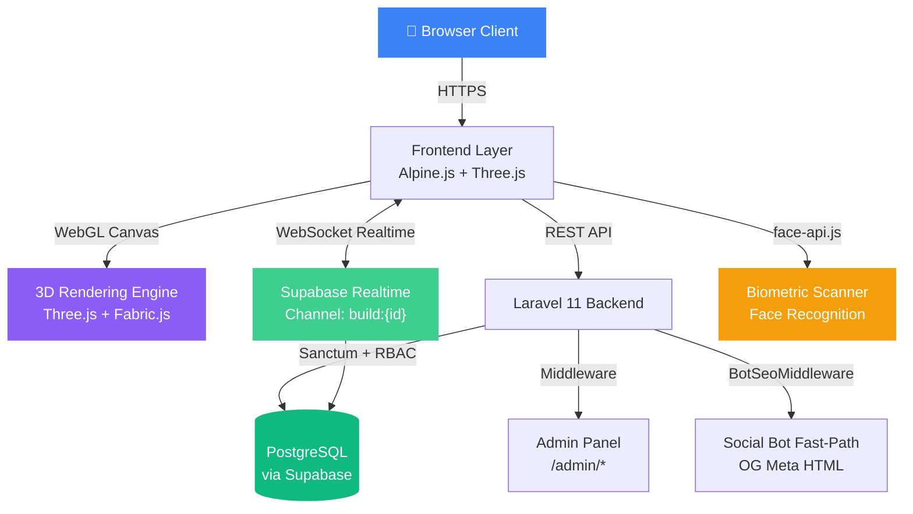

<div align="center">

  <!-- Banner — uses the og-meta.png that actually exists in the repo -->
  

  <h1>SpatialSync</h1>
  <p><strong>Next-Generation Collaborative 3D Architectural Engine</strong></p>
  <p><em>Real-time multi-user 3D building design — in the browser, no plugins required.</em></p>

  <p>
    <a href="https://spatialsync.onrender.com" target="_blank">🌐 Live Demo</a> &nbsp;·&nbsp;
    <a href="#-quick-start">⚡ Quick Start</a> &nbsp;·&nbsp;
    <a href="#-features">✨ Features</a> &nbsp;·&nbsp;
    <a href="#%EF%B8%8F-tech-stack">🛠️ Tech Stack</a> &nbsp;·&nbsp;
    <a href="#-team">👥 Team</a>
  </p>

  <br/>

  <!-- Badges -->
  
  
  
  
  
  
  

  <br/>

  <!-- CI/CD DevOps Badges 2026 -->
  
  
  
  
  
  <br/>
  
  
  
  
  
  
  
  
  
  

</div>

---

## 📋 Table of Contents

- [Overview](#-overview)
- [Suggested Repo Names](#-suggested-repo-names)
- [Features](#-features)
  - [3D Build Editor](#-3d-build-editor)
  - [Real-Time Collaboration](#-real-time-collaboration)
  - [Scenery & Environment](#-scenery--environment)
  - [Issue Tracker](#-issue-tracker)
  - [Biometric Authentication](#-biometric-authentication)
  - [Admin Panel](#-admin-panel)
  - [Pricing & Checkout](#-pricing--checkout)
  - [UI/UX 2026 Standards](#-uiux-2026-standards)
- [Tech Stack](#%EF%B8%8F-tech-stack)
- [Architecture](#-architecture)
- [Database Schema](#-database-schema)
- [Quick Start](#-quick-start)
  - [Prerequisites](#prerequisites)
  - [1 — Clone & Install](#1--clone--install)
  - [2 — Supabase Setup](#2--supabase-setup)
  - [3 — Environment Configuration](#3--environment-configuration)
  - [4 — Database Migration](#4--database-migration)
  - [5 — Build Assets & Run](#5--build-assets--run)
  - [6 — Create Admin Account](#6--create-admin-account)
- [Keyboard Shortcuts](#-keyboard-shortcuts)
- [Deployment](#-deployment)
- [API Reference](#-api-reference)
- [Team](#-team)
- [License](#-license)

---

## 🌐 Overview

**SpatialSync** is a premium, browser-native collaborative 3D architectural platform. Teams of architects, engineers, and designers can simultaneously construct, annotate, and review spatial layouts — all synchronised in sub-second real-time via Supabase WebSockets.

No desktop software. No plugins. Just open a browser.

> Built as a capstone academic project showcasing enterprise-grade engineering: real-time collaboration, biometric identity, WebGL 3D rendering, RBAC security, and a polished 2026 design system — all running on a PHP + Supabase stack.

---

## ✨ Features

### 🏗️ 3D Build Editor

The heart of SpatialSync — a full WebGL 3D editor running in the browser, powered by Three.js.

| Feature | Details |
|---|---|
| **16+ Smart Building Parts** | Walls, Floors, Roofs, Doors, Windows, Stairs — all with auto-height and auto-snap |
| **Multi-Floor Support** | Up to 10 independent floor levels with quick floor navigator (↑/↓ arrows) |
| **Custom Polygon Drawing** | Freeform geometry creation for irregular floor plans |
| **Texture Mapping** | Apply material textures (brick, marble, wood, glass) to any surface |
| **Wall Colour Picker** | Per-wall custom colour with real-time preview |
| **Roof Toggle** | Show/hide roof for interior inspection |
| **Undo / Redo** | Full history stack — `Ctrl+Z` / `Ctrl+Y` / `Ctrl+Shift+Z` |
| **Auto-Save** | Manual save + periodic auto-sync to Supabase |
| **Export PNG** | High-quality screenshot of the current 3D viewport |
| **Export JSON** | Full geometry data backup for re-import |
| **Export Blueprint PDF** | Professional 2D floor-plan drawing generated from the 3D model |
| **Orbit Controls** | Click-drag to rotate, scroll to zoom, right-drag to pan |
| **Keyboard Navigation** | Full shortcut system (see [Keyboard Shortcuts](#-keyboard-shortcuts)) |
| **Pricing Engine** | Dynamic cost estimation updates in real-time as parts are placed |

---

### ⚡ Real-Time Collaboration

Multiple users can edit the same build simultaneously with zero conflicts.

| Feature | Details |
|---|---|
| **Live Sync** | Sub-second state synchronisation via Supabase Realtime WebSocket channels |
| **Connection Indicator** | Live status badge: `Live` / `Syncing...` / `Reconnecting...` / `Offline` |
| **Reconnection Logic** | Automatic exponential backoff (5–6 s) with up to 5 retry attempts |
| **In-App Chat** | Persistent workspace chat panel — messages stored in the database |
| **Invite by Email** | Search registered users by name/email and add them directly |
| **Share Link** | Generate a one-click invite URL for external collaborators |
| **Role-Based Editing** | Editors can modify; Viewers get a read-only badge and cannot change anything |
| **Timestamped Mutations** | Conflict-free state resolution using server-side timestamps |

---

### 🌅 Scenery & Environment

Change the world your building lives in — all rendered in real-time 3D.

| Scenery | Description |
|---|---|
| 🏘️ **Modern Neighborhood** | Sidewalks, roads & city trees |
| 🌲 **Nature & Mountains** | Forest backdrop with rolling hills |
| 🏙️ **Urban City** | Dense city blocks & grid streets |
| 🏜️ **Desert Oasis** | Sand dunes & arid landscape |

**Day / Night Toggle** — Switch between full sunlight and an atmospheric night scene with a single click (or press `B`). Ambient lighting, shadows, and sky colour all update live.

---

### 🐛 Issue Tracker

Built directly into the collaboration sidebar — no external tool required.

- Create issues with title, description, priority, and status
- Status workflow: `Open` → `In Progress` → `Resolved`
- Live badge count on the Issues tab
- Linked to the specific build

---

### 🔐 Biometric Authentication

SpatialSync implements **passwordless Biometric login** using the device camera.

- **Face Recognition** — powered by `face-api.js` with pre-trained TensorFlow.js models
- **Face Model HUD** — real-time facial landmark overlay during scan
- **Fallback** — standard email/password login always available
- **Model Loading Indicator** — "Initialising Neural Engine..." state while face models load
- **Threshold Configurable** — recognition confidence threshold in `BiometricAuthController.php`

---

### 🛡️ Admin Panel

A dedicated admin interface for platform management.

| Page | Features |
|---|---|
| **Dashboard** | Platform-wide stats, user activity, recent builds |
| **Users** | View all registered users, promote to admin, deactivate accounts |
| **Builds** | View, manage, or delete any build on the platform |
| **Presets** | Create and manage reusable building-part presets |
| **Security** | Audit logs, RBAC overview, permission management |

**Role Levels:**
- `Admin` — Full platform access, user management, all builds
- `Editor / Architect` — Create and edit their own builds, invite members
- `Viewer` — Read-only access to shared builds

---

### 💳 Pricing & Checkout

- **Dynamic Material Pricing** — Estimated cost updates live as parts are added/removed
- **Checkout Flow** — Simulated plan upgrade page
- **Contact Sales** — Enterprise inquiry form

---

### 💎 UI/UX 2026 Standards

SpatialSync is built on the **OpenCode UI/UX 2026** design system.

- **Design Language:** Premium Modern — polished, confident, professional
- **Design Tokens:** 3-tier token system (global → semantic → component) in CSS custom properties
- **Dark & Light Mode** — `[data-theme]` toggle on `<html>`, persisted across sessions
- **10-State Components** — Every interactive element handles: `default`, `hover`, `focus`, `active`, `loading`, `disabled`, `error`, `success`, `empty`, `busy`
- **Mobile-First** — Designed at 390 px, expands outward
- **8px Grid** — All spacing on the 8 px scale
- **Glassmorphism** — Auth pages, modals, and panels use `backdrop-filter: blur()`
- **Micro-Animations** — Stagger reveals, hover lifts, connection pulse animations
- **SweetAlert2** — All alerts and confirmations use a custom-themed SweetAlert2 mixin — no native `alert()`
- **Lucide Icons** — Consistent icon set throughout
- **Fluid Typography** — `clamp()` based scaling for headings
- **Skeleton Loading** — Every async state has a shimmer skeleton, never a blank screen

---

## 🛠️ Tech Stack

### Backend
| Technology | Version | Purpose |
|---|---|---|
| **Laravel** | 11.x | Core MVC framework, routing, middleware, auth |
| **PHP** | 8.2+ | Server runtime |
| **Laravel Sanctum** | 4.x | API token authentication |
| **Laravel Jetstream** | 5.x | Team management scaffolding |
| **Livewire** | 3.x | Server-rendered reactive components |
| **Laravel Pint** | 1.x | Code style enforcement |

### Database & Real-Time
| Technology | Purpose |
|---|---|
| **Supabase** | Managed PostgreSQL + Realtime WebSocket engine |
| **PostgreSQL** | Primary relational database (via Supabase) |
| **Supabase Realtime** | WebSocket channels for live state sync |
| **Supabase Storage** | File and asset storage |
| **Supabase PHP SDK** | `saeedvir/supabase` — server-side DB queries |

### Frontend
| Technology | Version | Purpose |
|---|---|---|
| **Three.js** | 0.183 | WebGL 3D rendering engine |
| **Fabric.js** | 5.x | Canvas 2D overlay for blueprint/floor-plan tools |
| **Alpine.js** | 3.x | Lightweight reactivity and component state |
| **@supabase/supabase-js** | 2.x | Client-side Realtime subscription |
| **face-api.js** | — | Browser-native face recognition (TensorFlow.js) |
| **Tailwind CSS** | 3.4 | Utility CSS framework |
| **Vite** | 5.x | Asset bundler and dev server |
| **Lucide Icons** | Latest | Icon library |
| **SweetAlert2** | 11.x | Premium modal dialogs |

### Infrastructure & DevOps
| Technology | Purpose |
|---|---|
| **Render** | Production cloud hosting |
| **Docker** | Containerised deployment (`Dockerfile` included) |
| **GitHub Actions** | CI/CD pipeline & release automation |
| **Dependabot** | Automated dependency security updates |
| **Husky + lint-staged** | Pre-commit hooks for code quality gates |
| **Commitlint** | Conventional Commits enforcement |
| **Semantic Release** | Automated versioning, changelog & GitHub releases |
| **PHPStan (max level)** | Static analysis for PHP |
| **Laravel Pint** | Opinionated PHP code style |
| **ESLint + Prettier** | JavaScript linting & formatting |
| **CodeQL** | GitHub Advanced Security SAST scanning |
| **CycloneDX SBOM** | Software Bill of Materials generation |

---

## 🏛️ Architecture



### Key Architectural Decisions

| Decision | Rationale |
|---|---|
| **Supabase Realtime over Laravel Echo** | Zero infrastructure overhead — no Redis or separate WebSocket server needed |
| **Debounced display status (3 s)** | Prevents UI jitter from transient network drops without alarming the user |
| **8-second grace period on connect** | Avoids false "disconnected" alerts during initial page load |
| **BotSeoMiddleware (prepend)** | Social scrapers (Facebook/Twitter) get instant static OG HTML — bypasses full SPA boot |
| **face-api.js on client** | Face recognition runs 100% in-browser — no biometric data ever leaves the device |

---

## 🗃️ Database Schema

```
users                  — Auth accounts, admin flag, profile data
├── teams              — Workspace teams (Jetstream)
├── personal_access_tokens — Sanctum API tokens

builds                 — 3D build projects (name, owner, visibility)
├── build_parts        — Individual 3D parts (type, position, rotation, texture, colour, shape_points)
├── build_members      — Collaborator list with role (admin/editor/viewer)
├── build_messages     — In-app chat messages per build
├── build_shares       — Shareable invite token links
├── build_issues       — Bug/issue tracker entries per build
└── part_presets       — Reusable part templates (admin-managed)

notifications          — Platform-wide notification records
```

> **Supabase Realtime** is enabled on `build_parts`, `build_messages`, and `build_issues` tables. See `database/migrations/enable_supabase_realtime.sql`.

---

## ⚡ Quick Start

### Prerequisites

Make sure you have the following installed:

| Tool | Version | Check |
|---|---|---|
| PHP | ≥ 8.2 | `php -v` |
| Composer | ≥ 2.x | `composer -V` |
| Node.js | ≥ 18.x | `node -v` |
| npm | ≥ 9.x | `npm -v` |
| Git | Any | `git -v` |

You also need a free **[Supabase](https://supabase.com)** account and project.

---

### 1 — Clone & Install

```bash
# Clone the repository
git clone https://github.com/dev-lou/SpatialSync.git
cd SpatialSync

# Install PHP dependencies
composer install

# Install Node dependencies
npm install
```

---

### 2 — Supabase Setup

1. Go to [supabase.com](https://supabase.com) → **New Project**
2. Note down your **Project URL**, **anon key**, and **service_role key** from:
   `Settings → API`
3. Note down your **Database Host** from:
   `Settings → Database → Connection String → URI` (use the **pooler** host on port `6543`)
4. Run the full schema in the **SQL Editor**:

```sql
-- Copy and paste the entire contents of:
database/migrations/supabase_schema.sql
```

5. Enable Realtime on the required tables:

```sql
-- Copy and paste:
database/migrations/enable_supabase_realtime.sql
```

6. *(Optional)* Seed with example data:

```sql
-- Copy and paste:
database/migrations/supabase_migration_data.sql
```

---

### 3 — Environment Configuration

```bash
# Copy the example environment file
cp .env.example .env

# Generate a unique application key
php artisan key:generate
```

Now open `.env` and fill in your values:

```dotenv
APP_NAME="SpatialSync"
APP_ENV=local
APP_KEY=            # auto-filled by php artisan key:generate
APP_DEBUG=true
APP_URL=http://localhost:8000

# ── Supabase ─────────────────────────────────────────
SUPABASE_URL=https://xxxxxxxxxxxx.supabase.co
SUPABASE_SERVICE_KEY=eyJhbGciOiJIUzI1NiIsInR5cCI6IkpXVCJ9...
SUPABASE_ANON_KEY=eyJhbGciOiJIUzI1NiIsInR5cCI6IkpXVCJ9...

# ── Database (Supabase PostgreSQL pooler) ────────────
DB_CONNECTION=pgsql
DB_HOST=db.xxxxxxxxxxxx.supabase.co
DB_PORT=6543
DB_DATABASE=postgres
DB_USERNAME=postgres
DB_PASSWORD=your-supabase-password

# ── Session & Cache ──────────────────────────────────
SESSION_DRIVER=file
CACHE_DRIVER=file
QUEUE_CONNECTION=sync
```

> ⚠️ **Never commit your `.env` file.** It is already listed in `.gitignore`.

---

### 4 — Database Migration

Run Laravel's built-in migrations (creates the local relational tables Sanctum needs):

```bash
php artisan migrate
```

> The main application data (builds, parts, messages) lives in **Supabase PostgreSQL** and was set up in Step 2. The Laravel migrations handle `users`, `teams`, `personal_access_tokens`, and `notifications`.

---

### 5 — Build Assets & Run

Open **two terminal windows** side-by-side:

**Terminal 1 — Vite Dev Server (hot reload):**
```bash
npm run dev
```

**Terminal 2 — Laravel Server:**
```bash
php artisan serve
```

Your app is now running at **[http://localhost:8000](http://localhost:8000)** 🎉

> **Production build** (when deploying):
> ```bash
> npm run build
> php artisan config:cache
> php artisan route:cache
> php artisan view:cache
> ```

---

### 6 — Create Admin Account

1. Register a new account at `/register`
2. In your Supabase dashboard → **Table Editor** → `users`
3. Find your user row and set `is_admin = true`
4. Refresh the app — the **Admin** link will appear in your navigation

Alternatively via Laravel Tinker:
```bash
php artisan tinker
```
```php
\App\Models\User::where('email', 'your@email.com')->update(['is_admin' => true]);
```

---

## ⌨️ Keyboard Shortcuts

These shortcuts are active while inside the **3D Build Editor**:

| Key | Action |
|---|---|
| `W` `A` `S` `D` | Move the selected part |
| `R` | Rotate selected part 45° |
| `G` | Delete selected part |
| `T` | Open Transform mode |
| `SPACE` | Reset camera to default view |
| `Q` | Cancel current action |
| `B` | Toggle Day / Night mode |
| `Ctrl + Z` | Undo last action |
| `Ctrl + Y` / `Ctrl + Shift + Z` | Redo |

---

## 🚀 Deployment

SpatialSync includes a complete production configuration for **[Render](https://render.com)**.

### Using render.yaml (recommended)

```bash
# The render.yaml at the project root configures the service automatically.
# Just connect your GitHub repo to Render and it will detect it.
```

### Required Environment Variables on Render

Set all variables from your `.env` in **Render → Environment**. Key production overrides:

```dotenv
APP_ENV=production
APP_DEBUG=false
APP_URL=https://your-custom-domain.com
SESSION_DRIVER=file
CACHE_DRIVER=file
```

### Docker

A `Dockerfile` is included for custom container deployments:

```bash
docker build -t spatialsync .
docker run -p 8000:8000 --env-file .env spatialsync
```

---

## 📡 API Reference

All API routes are prefixed with `/api` and protected by **Laravel Sanctum**.

### Build Parts
| Method | Endpoint | Description |
|---|---|---|
| `GET` | `/api/builds/{id}/parts` | Fetch all parts for a build |
| `POST` | `/api/builds/{id}/parts` | Create a new part |
| `PUT` | `/api/parts/{id}` | Update part position/rotation/texture |
| `DELETE` | `/api/parts/{id}` | Delete a part |

### Collaboration
| Method | Endpoint | Description |
|---|---|---|
| `GET` | `/api/builds/{id}/messages` | Get chat history |
| `POST` | `/api/builds/{id}/messages` | Send a chat message |
| `GET` | `/api/builds/{id}/members` | List collaborators |
| `POST` | `/api/builds/{id}/members` | Invite a collaborator |
| `PUT` | `/api/permissions/{id}` | Update member role |

### Issues
| Method | Endpoint | Description |
|---|---|---|
| `GET` | `/api/builds/{id}/issues` | List build issues |
| `POST` | `/api/builds/{id}/issues` | Create an issue |
| `PUT` | `/api/issues/{id}` | Update issue status/priority |
| `DELETE` | `/api/issues/{id}` | Delete an issue |

### Build Sharing
| Method | Endpoint | Description |
|---|---|---|
| `POST` | `/api/builds/{id}/share` | Generate shareable invite link |
| `GET` | `/join/{token}` | Join via invite token |

---

## 📄 License

This project is licensed under the **MIT License**.  
See the [LICENSE](LICENSE) file for full details.

```
MIT License — Copyright (c) 2026 SpatialSync Team
```

---

<div align="center">

**Built with ❤️ by the SpatialSync Team · 2026**

[🌐 Live Demo](https://spatialsync.onrender.com) &nbsp;·&nbsp; [🐛 Report a Bug](https://github.com/dev-lou/SpatialSync/issues) &nbsp;·&nbsp; [💡 Request a Feature](https://github.com/dev-lou/SpatialSync/issues)

</div>
